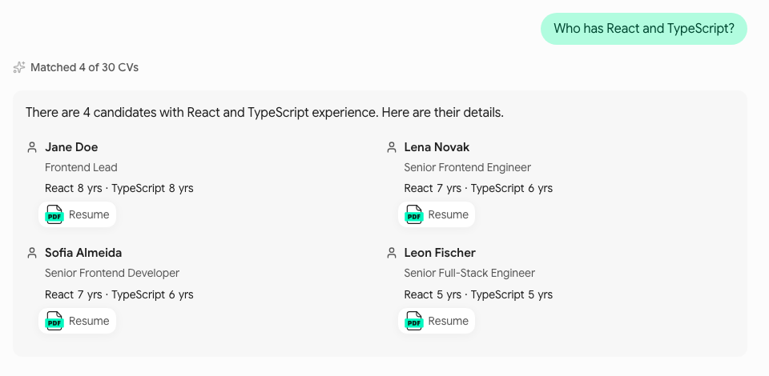

# AI-Powered CV Screener

A recruiter has about thirty CVs and one open job. This tool lets them ask
questions about the CVs in plain language. For example: "who has five years
of React and speaks German?" The answer lists the candidates that match.
Each candidate links to the page of their CV that states the fact. The
recruiter checks the evidence, not the model.

The tool does not decide who to hire. It makes that decision faster and
easier to support.

This is a pilot. One team, one pool of CVs, deployed on Vercel behind
Vercel Authentication.

## How it works

### CV generation

`npm run generate` builds the pool of 30 CVs in three steps. Each step
skips what already exists.

- **Seeds.** A fixed roster of 30 candidates is in the code: name,
  headline, role, seniority and an EU city. Gemini writes the rest of each
  CV as JSON, checked against the candidate schema and a set of rules. The
  seeds are the ground truth for the tests.
- **Photos.** One portrait per candidate from an image model on Cloudflare
  Workers AI, reproducible from a seed. The step runs only when named.
- **PDFs.** One CV per seed, rendered from one template in three
  variants, at most three pages each.

### RAG workflow

`npm run index` turns the PDFs into what the model can use, in three
steps.

- **Text.** Each page's text is split into sections at the CV's own
  headings. Each section on each page is one chunk.
- **Profile.** Gemini writes a structured profile from the chunks, and the
  app locates every field in the CV text. The result is one JSON file per
  CV.
- **Vectors.** Each chunk is embedded and stored in Pinecone.

At question time the model does not read the CVs. It calls tools: exact
filters and counts over the index, full profiles for named candidates, and
a search by keyword and by meaning for free text. Every result carries its
evidence and page, so the model can only say what a tool returned.

### Chat interface

One page. A text box takes the question, with an example
question as its placeholder. The answer streams in: the progress, then the
text, then the view.

Asked "Who has React and TypeScript?", the app opens with its own
sentence, "There are 4 candidates with React and TypeScript experience.
Here are their details.", and lists the four with their years and a link
to the CV page that states them.



Screenshot from the component previews.

The model asks for a view in its `present` call, and the app builds it
from what the tools returned. Which view each kind of question gets, and
how a follow-up narrows the last answer, are in the
[PRD](docs/PRD.md) (§5, §10).

## Architecture

### How an answer comes to be

This is the agentic form of RAG: retrieval is a set of tools the model
calls, not text pasted before the question.

![Before use, npm run generate writes 30 CV PDFs, and npm run index has Gemini extract a profile from each, locates every field in the CV text so each fact has a page, and embeds each chunk into Pinecone. At question time the chat screen sends the question and the history to POST /api/ask, whose prompt holds no CV text. Gemini calls tools in a loop: three exact queries over the index in memory, and a text search that embeds the query and fuses BM25 with Pinecone. The loop ends with present. The app checks every candidate and page against what the tools returned, writes the counts itself and streams the answer to the chat. A source link opens the CV PDF at the cited page.](docs/images/architecture.svg)

### Layers

The code is grouped by what it does, not by technical layer. [src/lib](src/lib)
has five domain modules, each usable from a route, a script or a test,
without React:

- [screening](src/lib/screening) is the core: one question in, one answer
  out. It runs the answer loop, the tools and the view.
- [candidates](src/lib/candidates) owns the pool: the index and each
  candidate's verified profile.
- [search](src/lib/search) finds CV text by keyword and by meaning, and
  joins the two.
- [models](src/lib/models) talks to the language models: which ones, how
  they are called, and what happens when a call fails.
- [conversation](src/lib/conversation) is what the recruiter sends and sees.

Dependencies flow one way, from the app and the scripts to these modules,
and from them to the contracts. The rules are in [AGENTS.md](AGENTS.md).

### The design system

The values are design tokens in [tokens/](tokens), in the W3C Design
Tokens format (DTCG 2025.10), read through a resolver with a light and a
dark theme. The rules are [DESIGN.md](DESIGN.md), which holds no values
and names tokens by their ids; its Overview explains the three tiers.
`npm run design:export` checks the components' contract in `DESIGN.md`
against the tokens, then Terrazzo writes the two generated stylesheets the
Tailwind theme reads. What the design lint checks is in
[src/components/README.md](src/components/README.md).

![Four columns. Authored: the palette, the roles and the resolver in tokens/, and the components contract and the rules in DESIGN.md. Build: design:export checks the components contract, then Terrazzo resolves light and dark. Generated, never edited: tokens.generated.css holds every token as a variable, theme.generated.css the roles as the Tailwind theme with a dark variant. Consumed: Tailwind 4, with its own palette reset, feeds the components, which use role classes only; the palette stops before them. Below, four checks run on every edit and commit, as errors for an agent and warnings for a human: the ESLint design rules, design:lint, design:export --check and the agent hooks.](docs/images/design-system.svg)

## Decisions and why

- **Typed tools over the index, not a plain RAG prompt.** Most recruiter
  questions are exact: years, languages, roles, counts. These run as
  queries, so the answer is the query result and the model only puts it in
  words. Search by meaning is kept for the questions the filters cannot
  express.
- **The app writes the counts, the lists and the first sentence.** A count
  comes from the tool, a list after a filter has every match, and the
  opening sentence comes from the filter and its result. The model cannot
  drop a candidate or add one.
- **Every cited page is checked.** The model names candidates and pages. A
  candidate no tool returned fails the answer. A page no tool cited is
  replaced with one that was.
- **Sources are found in the CV text during indexing, not at question
  time.** Each profile field is located on a page, so the link the
  recruiter clicks opens where the fact is written, and a fact the text
  does not state is dropped before any question is asked.
- **One fixed model, named in the environment.** One behaviour to tune the
  prompt for, and no choice for the recruiter. The name lives in
  `.env.local`, so a swap is a configuration change, and the evaluation
  can run a candidate first.
- **Evaluation lives in the code.** The test questions carry their expected
  answers as rules over the seed data, so they still work after the pool
  is regenerated.
- **The design system is enforced, not described.** Each fact has one
  owner: every value is a token, every rule is in `DESIGN.md`. DTCG is the
  interchange standard every token tool reads, and the design.md format
  imports tokens rather than duplicating them
  (google-labs-code/design.md#13). A rule nobody checks drifts, so a lint
  fails on any class outside the tokens, any colour made by opacity and
  any read of the palette, as warnings for a person and errors for an
  agent and CI. Hover, pressed and the other derived roles are a plain
  colour per theme, their rule kept on the token, as in every major design
  system.

## Stack

| Layer | Choice |
|---|---|
| Framework | Next.js 16 (App Router), React 19, TypeScript strict |
| Model access | Vercel AI SDK 7; Google Gemini through the Gemini API; Cloudflare Workers AI for the CV photos |
| Schemas | Zod 4, one contract per area in [src/contracts](src/contracts) |
| Search | MiniSearch for BM25, Pinecone for vectors, reciprocal rank fusion |
| PDF | pdf.js for text and the in-app preview; react-pdf to render the sample pool |
| Styling | Tailwind 4 with a theme Terrazzo builds from the design tokens in [tokens/](tokens), tailwind-variants, Headless UI |
| Tooling | Vitest, Storybook 10, ESLint, tsx for the scripts |
| Runtime | Node 22, from `.nvmrc` |

## Testing

Unit tests live in a `__tests__` folder beside the code they test, with
fakes for the model and the stores. An accuracy check compares every
indexed profile with its seed, field by field. The evaluation asks the
real pipeline the golden questions and scores the model against fixed
thresholds, showing the cost before any model call.

```bash
npm test
```

The accuracy check and the evaluation call models; their commands are in
[AGENTS.md](AGENTS.md), Commands.

## Component previews

Storybook shows every component in every state, in light and dark,
against the mocks, with the accessibility addon on each story.

```bash
npm run storybook
```

It opens on port 6006. `npm run build-storybook` writes a static copy.

## Working with an agent

The repository is set up so that an agent builds the same way a person
does, and cannot drift from the design system unnoticed.

- [AGENTS.md](AGENTS.md) is the contract: conventions, commands, and what to
  ask before doing. `CLAUDE.md` points at it and asks for plan mode before a
  feature.
- The skill in [.claude/skills/building-ui-components](.claude/skills/building-ui-components/SKILL.md)
  is the procedure for UI work: read `DESIGN.md` first, choose the kind of
  component, build in the order the conventions expect, close with the
  checks. It loads itself when a file under `src/components`, `src/hooks`,
  `src/app` or `.storybook` is touched.
- The hooks in [.claude/settings.json](.claude/settings.json) enforce what
  the skill describes, and `.githooks/pre-commit` is the same commit gate
  for a person. What each one runs is in `AGENTS.md`, Harness.
- The design rules themselves are in `scripts/design-lint`, described in
  [src/components/README.md](src/components/README.md); the tokens' pipeline
  is in `scripts/design-tokens`.

## Repository

```
docs/PRD.md          what we build and why
DESIGN.md            the design system's rules: what each token means and which roles each component reads
tokens/              the design tokens: every value, as W3C Design Tokens with a light and a dark theme
AGENTS.md            engineering conventions and the full command list
src/app/             routes: the screen, the ask API, the CV file API
src/components/      UI, with its own README on how components are built
src/hooks/           React glue, each hook with its own logic beside it
src/contracts/       the Zod schemas shared by the client, the server and the scripts
src/lib/             the domain: screening, candidates, conversation, models, search
src/mocks/           test doubles and the sample index
scripts/             the pipelines, with their own README: generation, ingestion, evaluation, design tokens, design lint
data/                the pool: generation seeds and photos, the index, the CVs, and the evaluation reports once npm run eval has run
.claude/             the agent's skill for UI work and the hooks that run the lint on every edit and before a commit
.githooks/           the same commit gate for a person, installed by npm run prepare
```

## Running it

```bash
nvm use
npm ci
cp .env.example .env.local   # then fill in the keys
npm run dev
```

Two services are needed. The Gemini API answers the questions and makes
the embeddings. Pinecone holds the vectors. `.env.local` takes the Gemini
key, the Pinecone key and index name, and the model names;
[.env.example](.env.example) sets the ones the pilot ran on. Without them
no question is answered. The app calls two of the models, the answer model
and the embedding model. The image model and the Cloudflare account id and
token are needed only by the photo step of the generator. The index and
the CVs are in the repository. The vectors are not:
`npm run index -- --step vectors` writes them, and creates the Pinecone
index when it does not exist yet.

### Deploying

The app runs on Vercel, imported from its GitHub repository: a push to
`main` deploys production, any other branch a preview. Vercel detects
Next.js and runs `npm run build`; `engines` in `package.json` picks Node 22,
as `.nvmrc` does locally.

Set Deployment Protection to All Deployments with Vercel Authentication
before the first deploy, in the team's defaults or the project's settings:
only members of the Vercel team open the app, so nobody else spends the
API credits (PRD, Non-goals). The project takes the runtime variables of
`.env.local` for Production and Preview: the Gemini key, `ANSWER_MODEL`,
`EMBEDDING_MODEL`, `PINECONE_API_KEY` and `PINECONE_INDEX`. The vectors
must already be in Pinecone; the deploy makes no model call. `/api/ask`
runs for at most its `maxDuration`, set beside it.

## Contributing

[AGENTS.md](AGENTS.md) is the contributing guide: the conventions, the
commands, the boundaries and the checks every commit runs. The commit gate
does not run the tests or the build, so run `npm test` and `npm run build`
before a pull request.

## Where to read next

[docs/PRD.md](docs/PRD.md) for what the product does and why.
[AGENTS.md](AGENTS.md) for the conventions and every command,
[scripts/README.md](scripts/README.md) for the pipelines,
[src/components/README.md](src/components/README.md) for how the UI is
built, [DESIGN.md](DESIGN.md) for the design system.
